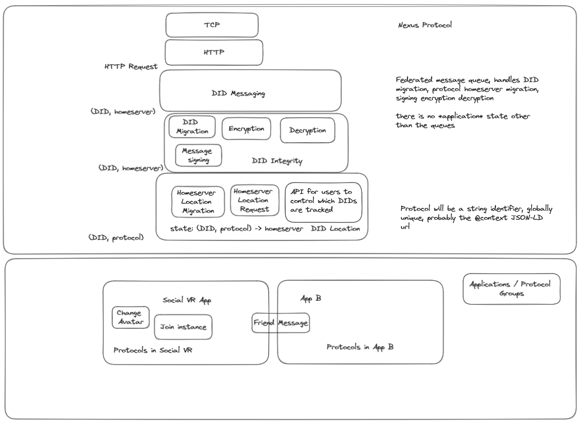

# Nexus Protocol

An open source federated messaging protocol, with a focus on encryption,
self-soverign identity, privacy, and ability to migrate homeservers.

Messages are arbitrary payloads - they can be arbitrary information. Common use
cases include user's current social VR lobby, their current user bio, their
avatar, direct messsages, microblogging - its up to what you as a developer want
to support.

You can even tell users "hey, talk to me using this other entirely different
protocol that is specific to my game", using the Nexus protocol merely to
coordinate that handoff (likely to be very common when joining a multiplayer
lobby in video games, for example).

## Why use this over a centralized system?

Apps and games often run out of money and shutdown, or just never become popular
due to the powerful impact of network effects inhibiting adoption.

By using a federated system instead of a centralized one, users can self-host
servers (reducing costs for developers), access new apps with low friction,
and seamlessly engage in social interactions across different apps. The
interoperability will lead to a dilution of the aforementioned network effects,
helping smaller indie or open source games and apps, and also improve users
ability to migrate between ecosystems.

## Feature List

The basic features in Nexus are:
* Create an account/identity that you can prove you own
* Migrate identity to new keys and new hosts
* Migrate your homeserver
* Automatically listen for homeserver migrations of people you know
* Send and receive messages to others
* End-to-end encryption
* Sign messages

### What is not in scope

* A concept of "avatars", "lobbies", etc. This information is to be represented
  by the application-specific schemas for the message payloads. We will be
  providing separate JSON schemas that developers can adopt for ineroperable
  ways to represent this info.

## General principles

* If possible to hide information from a party that doesn't need to see it, we
  should
* We want to trust homeservers and identity providers as little as possible
* We want the system to be federated, which means there is no single group that
  holds control.
* We will (eventually) use public key cryptography and Decentralized Identifiers
  (DID protocol) to allow users to sign and encrypt messages/data.

## High Level Overview

There are several pieces to the software, described below as an overview.

### Network Topology
There are servers (homeservers) and clients (users). Each user belongs to a
homeserver, although they can migrate to different homeservers. A user might
choose to migrate to a different homeserver for any reason, most commonly
because the homeserver is dead, performing poorly, untrustworthy, or moderating
unfairly.

Clients talk with their homeservers over a Client-Server HTTP api, using
JSON-LD. Some of these messages terminate at the homeserver, and some are queued
to be sent to other homeservers, which in turn deliver them to other clients.

There is also a Server-Server HTTP api, with JSON-LD as the payload. This is the
part of the protocol that performs federation amongst servers.

Clients are generally fairly transient and have less state than servers. Also,
the client-server api should be simpler than the server-server api, making it
easier to develop a client. Clients are generally run as part of a game or
program on an end-user's computer.

The servers are hosted by technical individuals, often community members
invested in a game that uses Nexus, and might be a paid or free service. The
servers set their own access policies for clients, rate limiting, etc. We might
add this into the spec to have a standardized way of doing this.


### UUIDs
A [Universally Unique Identifier][UUID](UUID) is a 128-bit random number that we
use to represent a user's ID. Every user has their own `uuid`.

In reality, a user's identity is actually based on the full list of past and
present `did`s, but using that can be practically inconvenient in many
situations. Therefore, we use the `uuid` as it does not need to change when a
user switches their `did`.

*TODO*: This is incorrect. The assumption that there are no collisions is not
guaranteed, so we need to handle the case where they collide. Also, we cannot
assume that generating UUIDs is random - I could copy someone else's UUID and
try to use that as my own when creating a new account. So we need to think of a
better way. Luckily we can always fall back to the historical DID list. Edit:
What historical DID list? I don't think that exists in the version we were
originally describing, except in the thing that the user saves to the
homeserver. Is that an issue?

### Decentralized Identifiers (DID)

[Decentralized Identifiers][did] are a way of representing in a global namespace
a user's identity. They typically also a way for users to describe a
cryptographic public key, which corresponds to a private key they keep safe and
hidden. The DID provides a mechanism to resolve this public key + metadata.

Using their DID, users can sign messages they send (proving that the message was
not tampered and that they are the original author), and they can encrypt
messages to other uses using the other user's DID.

DIDs can take many forms - some are just public keys in base64 encoding, some
are links to web servers that serve the public keys, some are stored on
blockchains or cyrptographic file systems like IPFS. For this implementation, we
chose two use solutions that don't require any sort of blockchain - [`did:key`]
and [`did:web`].

Users will add a new DID by sending a message to their homeserver and all their
friends The same goes for removal. Users can have multiple DIDs. They need at
least one. They can remove old DIDs.

Note that `did:web` is served by a HTTP api and that server could change the
keys of the user it is representing. This is both a good thing (allows users to
request their server admin to replace the public key for them, if they forgot
the old one), and a bad thing (server hosters must be trusted to not steal
accounts from users by replacing the public key served with one that corresponds
to a private key that the server hoster controls).

`did:key` has no such indirection, and encodes the key directly in the identity.
But this means that if the private key is lost or leaked, the user has no
recourse other than deleting that `did:key` from their account via a DID removal
message (see later in the document), and risking a possiblity of that message
not fully propogating to all of their friends.

TODO: Uncertain about this paragraph. Homeservers also use DIDs, but they are
restricted to only `did:web` as they should manage their own keys and this
allows the protocol to guarantee that each homeserver has one and only one DID.
Note again, that `did:web` allows the homeserver to swap its public-private
keypair at any time.

## Security and Encryption

### Message signing
Every message is signed first by its original sender and then the sender's
homeserver.

TODO: Should it also be signed by the recipient's homeserver too? TODO: What
happens when `did:web` changes its referenced key? Wont validating the message
fail?

### Leaking IP addresses
Unlike a regular peer to peer network, a federated network allows clients to
avoid communicating directly with other clients. This means clients only have to
reveal their ip address to their own homeserver, but not to other random users.
Note that because messages sent between users are generic JSON-LD payloads, the
sender could provide a link to a server they control, and if the user retrieves
the data at the link, their ip address would be leaked.

To mitigate this, users might be able to request that their homeservers download
linked documents on their behalf, so the user never directly connects to those
resources.

### DID migration

Any modification to the user's current set of DIDs must signed with one of their
current DIDs. Likewise, users receiving a notification that one of their friends
modified their DID(s) must validate that the message was signed with the
previous DID.

Each user stores a persistent map somewhere of each of their friend's UUIDs to
their last known homeserver and set of DIDs:

```
Bob UUID -> (Bob homeserver, {Bob DID1, Bob DID2})
Alice UUID -> (Alice homeserver, {Alice DID1})
```

They may choose to store this locally on disk or encrypted and signed on their
homeserver. If they choose to store it on their homeserver, any modification to
this map will immediately be known by the user and that user should decide to
migrate homeservers for safety.

Whenever a client encounters a valid DID migration message, the client updates
their local map, uploads it to the homeserver, and then acknowledges the receipt
of the message.

### Message validation

For *any* message, not just DID migration messages, recipients validate the
signature of the message using their current understanding of the sender's DIDs.

If they encounter a message that doesn't match one of the last known DIDs of the
sender, one of a few scenarios must be happening:

1. The recipient's homeserver is malicious, and sending them fake did
   migrations.
2. The recipient has been offline for so long that their homeserver could not
   hold the undelivered messages any longer and had to skip some.
3. The recipient's homeserver was offline for so long that when it came back
   online and pulled DID updates from all its neighbor homeservers, those
   neighbor homeservers had ran out of space buffering the updates, and had to
   skip some.
5. Someone is spamming the recipient with fake messages.

These can be differentiated accordingly: ... TODO: I don't understand how we
solved this in the face of DID migraton. If the keys can change (both in did
migration and when `did:web` changes the referenced key), then how can we really
know anything?

### Quick notes because I gtg but I learned some stuff
Each user's "username" / "identity" is uniquely described by a "root" DID. Two
examples:
```
did:web:pki.example.com/alice#nexus-root-key
```
```
did:key:z2dmzD81cgPx8Vki7JbuuMmFYrWPgYoytykUZ3eyqht1j9KbrkpaRsa5Pmq4uMGcfH8ZpCr17NLSQ65Y4KwFmeMPK8MsqitrEFGBPzJDLBu49faYwiokzH43yBMjNQCf5PcTS8urcdLuFqjLKiX1kHGWn9NMoM6WbPMnbqdfwu7Eo9THMe
```

> NOTE: the root DID is the DID URI, and NOT necessarily the DID document
> itself. Every DID URI resolves to a DID resource - in the case of `did:key`
> this DID resourece is just the public keys encoded - without a need for any
> indirection. Whereas in `did:web` the DID document is retrieved via a GET
> request, adding a layer of indirection.
>
> Critically, this means that `did:web` trades away security for convenience -
> it is able to have complete control over what it returns in the GET request,
> so the actual public key can change in `did:web`. This is good for users
> because it means they can log into their identity server and upload a new
> public key in case they forgot or lost or leaked their private key.

However, this root identity is very sensitive and losing control over it means
losing access to your account, or worse, getting impersonated. So for day to day
affairs we generally will have a key-chain instead of one single root key. The
user will generate another DID, give it some permissions, and the root key will
sign that `(did, perms)` tuple so others know it is valid. The child key(s) can
then also sign additional child keys, forming a tree of keys with the root key
at the root. This allows a lot of flexibility. Parent keys can also easily
revoke child keys.

For example, I may use a `did:key` as my root DID, ensuring that I have final
control over my account. I want to keep this private key very safe - I print out
the private key, and bury it in random holes across the country. This is because
if I lose control over the DID, I lose my whole account.

Obviously I do not want to keep the private key on my computer, because it is
going to be used for everything in the games I play, and I don't trust that I
won't get hacked. So I take my private key and sign that I am allowing a
different DID to control my account - `did:web:did.thebutlah.com/nexus#my-key`.
I actually own `thebutlah.com` - I purchased the domain name and have it
registered with DNS and letsencrypt. I go ahead and delete my root private key
from my computer, it is safe in the paper backups.

I update my DNS to redirect `did.thebutlah.com` to another location called
`thebutlah.github.io/my-keys/nexus/did.json`. I get to login over OAuth2 to
github, upload a new public key at that URL, and better yet any server can
easily retrieve the public key because its hosted by github - I dont need to run
a webserver. I save the corresponding key to my google drive for safe keeping -
its a lot easier to use the google drive for stuff than unburying the paper
backup of the root key.

Finally, I use the github key to sign a `did:key` that I'll store on my personal
computer. This is the leaf node of this chain and I will use it to actually send
and receive messages on Nexus. This is the key that I use day to day.

If I ever get my computer hacked, I can invalidate it and re-issue a key from
github. If github ever goes down or becomes evil, I can change my dns record to
point to a different web hoster. If I forget to pay my domain host and they
assign my domain to someone else, I can dig up my paper backup, invalidate my
`did:web:did.thebutlah.com`, and reissue a new DID.

Hopefully I demonstrated that the strategy is very flexible, and ultimately as
long as the root key remains intact and in control, accounts can conduct
business, get child keys stolen, and still have recourse.

### Verifying keys.
We will not attempt global consensus, but rather lazy consensus. When you friend
a user, you send

Then I

--------------------------
## Layer Descriptions
The protocol is split into several layers:


### DID Messaging Layer

At this layer, the server is essentially just a relay + queue of HTTP requests.

Client:
* Client polls its homeserver via HTTP to receive messages.
* Client sends messages to `(DID, protocol, homeserver)`s by mapping the
  tuple to an HTTP endpoint, and making an HTTP request.
* Responsible for converting DID Message format to a HTTP Request

Server:
* Outbound and inbound message queues.
* Successfully sending messages to other homeservers pops them from outbound.
* Successfully responding to a poll from client pops them from inbound.
* Messages can timeout.
* Outbound messages will be sent with exponential backoff.
* Outbound messages sent via HTTP request
* Inbound messages sent as response to HTTP request from client.

### DID Integrity Layer

Responsible for encrypting, decrypting, signing, and verifying messages. Handles
DID chain migration.

TODO: This is all no-ops for now. We figured it out already but will document
and implement it soon.

### DID Location Layer

Responsible for keeping track of the homeserver of other DIDs an application protocol cares about.

Client
* Send our homeserver migration notification to a set of `(DID, protocol)`s.
* Send `(DID, protocol)` messages.
* Add a known user at `(DID, protocol, homeserver)` to local list and also to
  homeserver.

Server:
* Check for receipt of
* Stores the map of `DID -> protocol -> homeserver`
* Ta
* Maps `(DID, protocol)` to/from `(DID, protocol, homeserver)`

### Application Layer

This is whatever you want. Often, friend requests, follow/follows,
specific message types, etc go here.

## Protocols at the Application Layer

There are many possible protocols at the Application Layer. However, we will be
explaining one in particular that is likely to be very useful - the Discovery
Protocol.

### Discovery Protocol

Provides a way of asking a single homeserver for the full list of tuples of
`(protocol, homeserver)` for a given DID. This is for convenience - you only
need to remember the discovery protocol homeserver for a given DID to learn all
of the homeservers for its other protocols.

Security note: Relying on this is good for convenience, but means that if a
client migrates its discovery homeserver, it should keep a cache of
`DID -> protocol -> homeserver` to notify those DIDs of the migration via the
DID Location Layer.

## Collaborators

* [TheButlah](https://github.com/thebutlah)
* [Malek](https://github.com/MalekiRe)
* [Lyuma](https://github.com/Lyuma)
* [iFire](https://github.com/fire)

## License
Unless otherwise specified, all code in this repository is dual-licensed under
either:

- MIT License ([LICENSE-MIT](LICENSE-MIT))
- BSD 2-Clause Plus Patent License ([LICENSE-BSD](LICENSE-BSD))

at your option. This means you can select the license you prefer!

Unless you explicitly state otherwise, any contribution intentionally submitted
for inclusion in the work by you, shall be dual licensed as above, without any
additional terms or conditions.


[ActivityPub]: https://www.w3.org/TR/activitypub/
[Matrix]: https://spec.matrix.org/latest/
[UUID]: https://en.wikipedia.org/wiki/Universally_unique_identifier
[did]: https://www.w3.org/TR/did-core/
[`did:key`]: https://w3c-ccg.github.io/did-method-key/
[`did:web`]: https://w3c-ccg.github.io/did-method-web/
